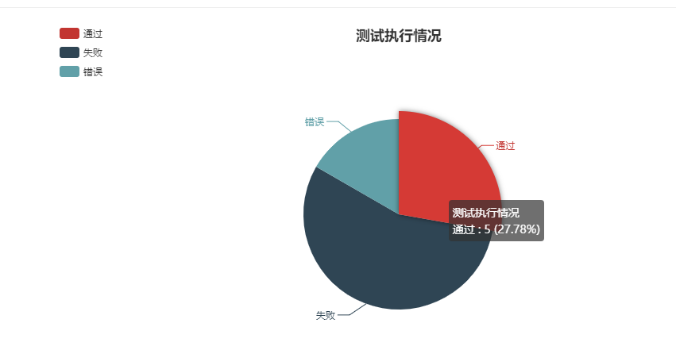

# HTMLTestRunner_PY3

## 2017.09.08 统计图 0.9.1

用Echarts添加了一个统计图，如下图：



**（2017.12.05）修改为使用cdn的方式，不用建文件夹导入js。**

~~需要echarts的js文件 `echarts.common.min.js` ，在报告文件夹下创建文件夹 `js` ，将该文件放入，生成报告就能看到该报告中的图表~~

~~~~

## 2017.08 修改为PY3版本 0.9.0

基于之前对PY2版本HTMLTestRunner的修改（中文以及美化，[链接点我](http://download.csdn.net/download/huilan_same/9598558)），现在针对PY3做了修改，增加对subTest的支持

1. StringIO -> io
2. 去掉decode
3. 增加addSubTest()

```python
# import StringIO
import io
...
  def startTest(self, test):
          TestResult.startTest(self, test)
          # just one buffer for both stdout and stderr
          # self.outputBuffer = StringIO.StringIO()
          self.outputBuffer = io.StringIO()
...
# add
def addSubTest(self, test, subtest, err):
        if err is not None:
            if getattr(self, 'failfast', False):
                self.stop()
            if issubclass(err[0], test.failureException):
                self.failure_count += 1
                errors = self.failures
                errors.append((subtest, self._exc_info_to_string(err, subtest)))
                output = self.complete_output()
                self.result.append((1, test, output + '\nSubTestCase Failed:\n' + str(subtest),
                                    self._exc_info_to_string(err, subtest)))
                if self.verbosity > 1:
                    sys.stderr.write('F  ')
                    sys.stderr.write(str(subtest))
                    sys.stderr.write('\n')
                else:
                    sys.stderr.write('F')
            else:
                self.error_count += 1
                errors = self.errors
                errors.append((subtest, self._exc_info_to_string(err, subtest)))
                output = self.complete_output()
                self.result.append(
                    (2, test, output + '\nSubTestCase Error:\n' + str(subtest), self._exc_info_to_string(err, subtest)))
                if self.verbosity > 1:
                    sys.stderr.write('E  ')
                    sys.stderr.write(str(subtest))
                    sys.stderr.write('\n')
                else:
                    sys.stderr.write('E')
            self._mirrorOutput = True
        else:
            self.subtestlist.append(subtest)
            self.subtestlist.append(test)
            self.success_count += 1
            output = self.complete_output()
            self.result.append((0, test, output + '\nSubTestCase Pass:\n' + str(subtest), ''))
            if self.verbosity > 1:
                sys.stderr.write('ok ')
                sys.stderr.write(str(subtest))
                sys.stderr.write('\n')
            else:
                sys.stderr.write('.')
...
  def run(self, test):
          "Run the given test case or test suite."
          result = _TestResult(self.verbosity)
          test(result)
          self.stopTime = datetime.datetime.now()
          self.generateReport(test, result)
          # print >>>sys.stderr '\nTime Elapsed: %s' % (self.stopTime-self.startTime)
          print('\nTime Elapsed: %s' % (self.stopTime-self.startTime), file=sys.stderr)
          return result
...
    # if isinstance(o,str):
    #             # TODO: some problem with 'string_escape': it escape \n and mess up formating
    #             # uo = unicode(o.encode('string_escape'))
    #             # uo = o.decode('latin-1')
    #             uo = o.decode('utf-8')
    #         else:
    #             uo = o
    #         if isinstance(e,str):
    #             # TODO: some problem with 'string_escape': it escape \n and mess up formating
    #             # ue = unicode(e.encode('string_escape'))
    #             # ue = e.decode('latin-1')
    #             ue = e.decode('utf-8')
    #         else:
    #             ue = e

            script = self.REPORT_TEST_OUTPUT_TMPL % dict(
                id = tid,
                # output = saxutils.escape(uo+ue),
                output = saxutils.escape(o+e),
            )
```

以上代码列出大部分主要修改。

如果有任何问题，可在此基础上再次进行修改。

关于PY3对subTest的支持，可以查看相关资料，在这里我的处理是：如果一个Case有使用subTest，则将此用例拆分成n个同级子用例，在report中是同级别展示的。


